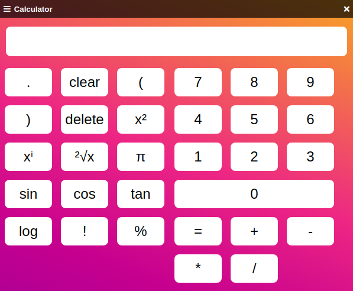
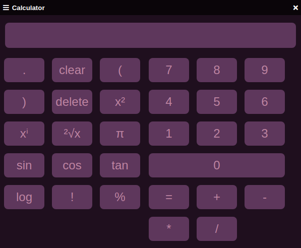
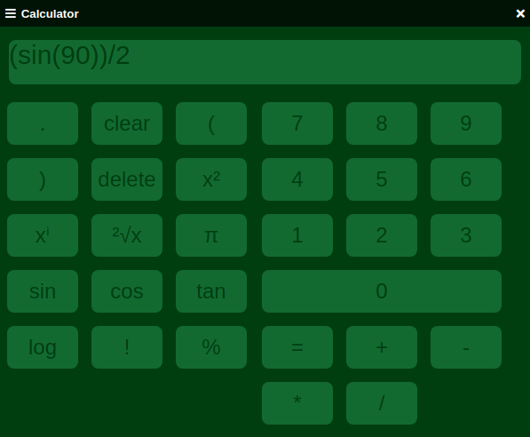

[![MIT License][license-shield]][license-url]

# A simple calculator created with react and electron

This is a standalone Electron app created with ReactJS and written is JavaScript and TypeScript

## Installation
1. [Download the latest release](https://github.com/JamesSheppardd/simple-calculator/releases) - for Windows systems download the zip called 'calculatorv' followed by version, and for Linux systems download the zip ending in 'Linux'
2. Unzip the 'release' folder
3. Run the file named 'Calculator Setup (version).exe' for windows, or 'calculator_1.0.0_amd64.deb' for Linux, then install when the software installer opens.
4. On linux to run open your terminal and run 'calculator', or windows just search for 'calculator' and save the a shortcut to the file somewhere accessible such as your desktop

## Module

### Math Expression Evaluator

I used the [math expression evaluator's](https://www.npmjs.com/package/math-expression-evaluator) eval function to parse the calculations from a string into an understandable JS calculation, and this module made it possible to add more complex mathematical functions, such as trigonometry or pi.

## Shortcuts

- 'Enter' or '=' to calculate answer
- 'f' to completely clear the calculation bar, or the down arrow
- Left or right arrow to navigate through the calculation bar
- Up arrow to get the last calculated answer
- 's' to square
- 'i' or '^' to raise to the power
- 'r' to square root
- 'p' for π
- 'q' for sin
- 'w' for cos
- 'e' for tan
- '!' for factorial

## Screenshots
To change the theme click the hamburger icon in the top left and go to 'options', then choose the theme

